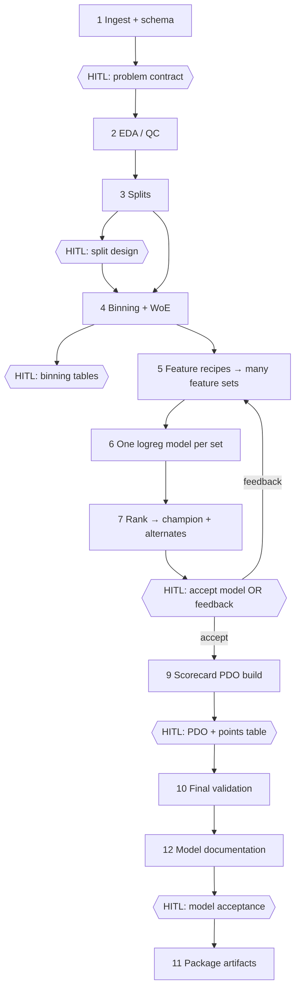

# Multi-agent predictive scorecard system — design specification

This document describes the **multi-agent architecture** for building a **binary logistic regression scorecard** (PDO-style scaling via optbinning) on tabular data. It is written as **implementation context** for a coding agent: orchestration, agent boundaries, human-in-the-loop (HITL) gates, data contracts, a **model documentation** deliverable (`model_documentation.md`), and mapping to the existing `predictive-model-agent` codebase.

**Primary references**

| Asset | Role |
|-------|------|
| [`agent_tools.py`](../agent_tools.py) | Validated functions for splits, EDA, binning, WoE, feature selection, `LogisticRegression` tuning, scoring, PSI, AUC/Gini, scorecard fitting |
| [`notebook/testing_tools.ipynb`](../notebook/testing_tools.ipynb) | Reference end-to-end workflow (HELOC-style example) |
| [`README.md`](../README.md) | Catalog of major `agent_tools` entry points |

**Dependencies:** Scorecard fitting uses **optbinning** (see `create_scorecard_model` in `agent_tools.py`). Logistic tuning uses **scikit-learn**. **Pydantic v2** is the recommended layer for orchestration state, HITL payloads, and persisted artifacts (see §3.3 and §4.1).

---

## 1. Goals

1. **Automate** the repeatable pipeline from raw/labeled tabular data through binning, WoE, multiple candidate models, and validation metrics.
2. **Produce** a deployable **scorecard** (points table + fitted objects) anchored on **logistic regression** on WoE features.
3. **Reserve human judgment** for business and risk decisions—not for micromanaging every feature-selection step.
4. **Support iteration:** when the user rejects the proposed champion, the system must reinterpret feedback as **constraints** and rerun the affected subgraph (see §7).
5. **Produce auditable model documentation** (`model_documentation.md`) that consolidates EDA, splits, transformations, selection, performance, stability, and issues for humans and downstream systems (see §5.2 phase **12** and §12).

---

## 2. Non-goals (initial version)

- Replacing optbinning with custom IV/WoE implementations (reuse `agent_tools` / optbinning).
- Auto-approval of models without a final human **model acceptance** gate (H6 in §5.2).
- Guaranteed regulatory compliance text (humans + policy owners remain accountable).

---

## 3. High-level architecture

### 3.1 Components

| Component | Responsibility |
|-----------|----------------|
| **Orchestrator** | State machine / graph runner; invokes sub-agents; persists **versioned artifacts**; routes to HITL UI or structured prompts; handles **rewind** after human edits or rejection. |
| **Sub-agents** | Specialized LLM + tool bindings over `agent_tools` (or direct tool calls without LLM where appropriate). |

### 3.2 Sub-agents (roster)

| Agent id | Name | Scope |
|----------|------|--------|
| `schema` | Data & schema | Load data, dtypes, column mapping, leakage checks at a high level. |
| `eda` | EDA / QC | Missingness, label rate over time, simple flags. |
| `split` | Split design | Temporal / type-based cohort labels. |
| `binning` | Binning & WoE | `BinningProcess`, optimal bins, binning tables, WoE extraction. |
| `feature_search` | Feature selection (recipes) | Runs **multiple** selection strategies in parallel (branches). |
| `model_train` | Logistic training | One tuned `LogisticRegression` per branch (same or harmonized hyperparameter search). |
| `model_rank` | Proposal | Hard filters + ranking; emits champion + alternates + rationale. |
| `scorecard` | Scorecard build | PDO scaling, points table, fitted `Scorecard` object. |
| `validate` | Validation report | Discrimination and stability by cohort and time. |
| `model_docs` | Model documentation writer | Assembles a single **Markdown** model card from run artifacts and tool outputs (§12); feeds **H6** as the primary evidence pack. |
| `compliance_assist` | Optional | Checklist narrative (fairness, documentation); **does not** replace human policy sign-off. |

The orchestrator may collapse some agents into one process for latency, but **logical boundaries** below should stay clear for testing and HITL attachment.

### 3.3 Typed contracts with Pydantic (recommended)

Use **[Pydantic v2](https://docs.pydantic.dev/)** as the **single source of truth** for anything that crosses agent boundaries, is persisted to disk, or is emitted/consumed at HITL gates.

**Why it improves this design**

| Concern | How Pydantic helps |
|----------|-------------------|
| LLM/tool drift | Tool and gate payloads are validated at runtime; invalid shapes fail fast with clear errors. |
| Reproducibility | Serialized artifacts (JSON) **round-trip** through models (`model_validate_json` / `model_dump_json`) so reruns and audits stay aligned with code. |
| Google ADK / LangGraph | Session state, `FunctionDeclaration`-style args, and interrupt payloads map cleanly to typed models instead of untyped dicts. |
| Multi-agent handoff | Each phase reads/writes known models; coding agents can generate stubs from field definitions. |

**Implementation rules**

1. **`agent_tools` remains authoritative** for modeling math; Pydantic wraps **inputs** to tool wrappers (and optionally normalizes **outputs** into summary DTOs for LLMs, while large tables stay paths or parquet refs).
2. **One module** (e.g. `schemas.py` or `contracts/`) owns all orchestration models; avoid duplicating parallel class hierarchies for MCP vs ADK unless generated from the same definitions.
3. Use **`model_config = ConfigDict(extra="forbid")`** (or equivalent) on externally supplied payloads (HITL, HTTP) to catch typos; internal state may use `extra="ignore"` only where backward compatibility requires it.
4. Version long-lived payloads with a **`schema_version: int`** field where migrations are expected (`constraint_spec`, `problem_contract`).

---

## 4. Data contract (orchestrator-owned)

The notebook pattern uses **semantic column names** (aliases). The orchestrator must store and pass:

| Field | Meaning |
|-------|---------|
| `col_time` | Event / application time (for splits and timely analysis). |
| `col_target` | Binary target. |
| `cols_feat` | Raw predictors for binning / scorecard input. |
| `col_type` | Sample type: e.g. `train`, `valid`, `test`, `hoot`, `oot`. |
| `col_month` / `col_day` | Derived period columns if used by tools. |
| `col_score` | Name for modeled score column once written. |

Helpers: `get_day_from_date`, `get_month_from_date`, `get_feature_dtype`, `get_nan_rate`, `get_nan_rate_timely`, etc.

**Coding agent requirement:** Serialize this contract in every run artifact (JSON/YAML) so reruns and audits are reproducible.

### 4.1 Pydantic models to define (illustrative names)

Implement the column contract and related gates as explicit models. Names are suggestions; adjust to your package layout.

| Model | Purpose |
|-------|---------|
| `DataColumnContract` | `col_time`, `col_target`, `cols_feat`, `col_type`, optional `col_month`, `col_day`, `col_score`; validators for non-empty `cols_feat`, target in frame, etc. |
| `ProblemContract` | H1 output: target definition text, exclusions, **forbidden** / **forced** feature names, success criteria (e.g. `min_gini_valid`, `max_psi_oot_score`). |
| `SplitConfig` | Parameters for `split_data` (or equivalent): thresholds, OOT/hoot flags, seed—whatever `agent_tools` requires. |
| `BinningSnapshotRef` | H3-approved state: pointer to serialized `BinningProcess` / dict bin spec + content hash. |
| `BinningRevision` | H3 `revise`: machine-editable overrides consumed by `modify_optimal_bin` path. |
| `RecipeSpec` | One feature-selection recipe: id, tool name, kwargs (`max_corr`, `min_delta`, …). |
| `FeatureSearchConfig` | Ordered or parallel list of `RecipeSpec`; optional caps (`max_features_global`). |
| `BranchResult` | `branch_id`, `recipe_id`, `features_woe: list[str]`, paths to metrics JSON, model URI, filter pass/fail reasons. |
| `RankerWeights` | Soft-score weights (valid Gini vs OOT vs parsimony); cohort keys for primary metric. |
| `ProposalBundle` | H4 input: `champion_branch_id`, `alternate_branch_ids`, per-branch summary rows, ranking audit trail. |
| `ConstraintSpec` | Post–H4 feedback: parsimony preference, metric emphasis, forced/forbidden updates, recipe toggles; include `schema_version`. |
| `HitlDecision` | Union or discriminated pattern: `gate_id` (`H1`…`H6`), action `approve \| revise \| reject`, optional typed payload per gate (`SplitConfig`, `BinningRevision`, `ConstraintSpec`, `PdoParams`, …). |
| `PdoParams` | H5: `base_score`, `pdo`, `odds` for `create_scorecard_model`. |
| `LogisticHyperparams` | Dict-compatible model or `dict[str, Any]` with validation for allowed sklearn keys only. |
| `RunManifest` | `run_id`, paths to all artifacts, git commit, data hash, `schema_version` for the manifest itself. |
| `ModelDocumentationMeta` | Optional: path to `model_documentation.md`, `doc_schema_version`, champion `branch_id`, content hash for CI “required headings” checks. |

**Orchestrator in-memory state** (e.g. LangGraph `TypedDict` or a single `RunState` Pydantic model with optional fields filled per phase) should still be **validated** when crossing a phase boundary or resuming after HITL.

---

## 5. End-to-end flow and human gates

### 5.1 Phase diagram

### 5.2 Phase descriptions

| Phase | Agent(s) | Automation | HITL |
|-------|-----------|--------------|------|
| **1** Ingest + schema | `schema` | Load parquet/CSV; map columns; dtype fixes. | **Gate H1:** Target definition, exclusions, feature eligibility, success criteria (e.g. min Gini on valid, max PSI rules). |
| **2** EDA / QC | `eda` | Missing rates, timely missing, `get_timely_binary_target_rate`, optional hard fails. | Optional if product defines automated thresholds only. |
| **3** Splits | `split` | `split_data` (or equivalent) → populate `col_type`. | **Gate H2:** Approve time windows, OOT/holdout definition, cohort sizes, leakage narrative. |
| **4** Binning + WoE | `binning` | `get_optimal_bin`, `get_binning_tables_from_bp`, `modify_optimal_bin` as needed, `get_woe_from_bp`. | **Gate H3:** Human approves merges/splits, missing/special bins, monotonicity where required. |
| **5** Feature sets | `feature_search` | Run **all configured recipes** (parallel branches)—see §6. | None (no approval of a single feature list before modeling). |
| **6** Models | `model_train` | Per branch: `train_logreg_l1_tune_cv` / `train_logreg_l2_tune_cv` (or fixed hyperparams); `logreg_predict` on full frame as needed. | None. |
| **7** Proposal | `model_rank` | Filter infeasible branches; rank by §6.2; emit champion + alternates + metrics tables. | **Gate H4:** User accepts champion **or** provides **structured feedback** → orchestrator updates **constraint spec** (§7) and reruns from **5** (or **4** if feedback is binning-related). |
| **9** Scorecard | `scorecard` | `create_scorecard_model` with frozen `BinningProcess`, approved `LogisticRegression` hyperparameters, PDO params. | **Gate H5:** Approve `base_score`, `pdo`, `odds` and business readability of points table. |
| **10** Final validation | `validate` | `get_score_predictive_power_data_type`, `get_score_predictive_power_timely`, `get_timely_vars_psi`, `get_timely_feature_psi_woe`, `compare_score_predictive_power_data_type_bootstrap` as needed. | None. |
| **12** Model documentation | `model_docs` | Render **`model_documentation.md`** from frozen artifacts (§12): required sections, embedded or linked tables, champion vs shortlist summary. May use an LLM for narrative glue; **numbers and tables must come from tool outputs / serialized artifacts**, not invented. | None; output is the primary input to **H6**. |
| **11** Package | Orchestrator | After **H6 `approve`**: write model bundle, scorecard, contracts, hashes, and the **same** `model_documentation.md` produced in phase 12 (immutable pointer in `RunManifest`). | None (execution only). |

**Gate H6 (after phase 12):** Human accepts or rejects the **champion model + scorecard +** **`model_documentation.md`** against `ProblemContract` (§4.1). On `reject` / `revise`, rewind per §5.3; **regenerate** phase 12 whenever upstream artifacts change. On `approve`, run phase **11**.

### 5.3 HITL implementation expectations

- Each gate consumes a **fixed schema**: summary metrics, small tables, diffs from previous approval, and explicit actions `approve | revise | reject`.
- Parse and validate every inbound HITL payload with **`HitlDecision`** (or gate-specific models) before mutating orchestrator state; reject invalid JSON at the API/UI boundary.
- **Revise** must carry machine-readable edits (e.g. binning overrides, split threshold changes, PDO triple, or constraint spec updates).
- Orchestrator **rewinds** only the subgraph affected by the revision (e.g. binning change → redo WoE, feature search, models, rank; PDO-only change → redo scorecard + validation).
- Any rewind that changes metrics or the champion model must **regenerate** `model_documentation.md` (phase **12**) before the next **H6** review.

---

## 6. Revised feature selection: multi-branch modeling

### 6.1 Principle

**Do not** block training on a human-approved single feature list. Instead:

1. Define a **recipe list** (config-driven) mirroring proven patterns in `testing_tools.ipynb`, for example:
   - `select_features_auc_max_corr`
   - `select_features_iv_max_corr`
   - `select_features_aic_forward` / `select_features_aic_backward`
   - `select_features_bic_forward` / `select_features_bic_backward`
   - `select_features_auc_forward` / (optional) backward variants
2. Each recipe yields a **branch id** and a **list of WoE column names** (`*_woe`).
3. Each branch trains **one** tuned logistic model on **train** (per `agent_tools` CV logic), reports on **valid/test/oot** as implemented.

### 6.2 Ranking (orchestrator / `model_rank` agent)

Implement **transparent** ranking, not a black-box “best”:

1. **Hard filters** (drop branch if any fail), e.g.:
   - Minimum sample counts in train / valid.
   - Both classes present in each evaluated cohort.
   - Optional: max PSI on OOT for the **score** or key WoE features (if thresholds exist in contract).
   - Forbidden features list from H1.
2. **Soft score** (example weights—tune via config):
   - Valid / test **Gini or AUC** (from `train_logreg_*_tune_cv` outputs or `get_score_predictive_power_data_type`).
   - **Stability:** PSI-style metrics where applicable.
   - **Parsimony:** penalty for excess features (same performance → fewer features wins).

**Output bundle for H4:**

- `champion_branch_id`, `alternate_branch_ids[]`
- Per-branch: feature count, key metrics table, stability highlights, training notes (e.g. convergence warnings from `logreg_predict`).

### 6.3 Notebook reference

The notebook demonstrates multiple `selected_feats_*` lists each followed by `train_logreg_l2_tune_cv` and later score comparison—treat that as the **semantic template** for parallel branches, orchestrated instead of hand-sequenced cells.

---

## 7. User feedback loop (after H4)

When the user is **not satisfied**, require **structured feedback** so the orchestrator can remap to operations:

| Feedback type | Example user intent | System response |
|---------------|---------------------|-----------------|
| **Fewer features** | “Simpler model” | Tighten `max_corr`, prefer BIC backward, cap `max_features`, or increase parsimony weight in ranker. |
| **Cohort emphasis** | “Optimize OOT, not valid” | Change ranking weights or primary metric; optionally revisit H2 splits (with new HITL). |
| **Include / exclude variables** | “Must not use X” | Update forbidden/forced lists; rerun branches 5–7. |
| **Performance floor** | “Need higher Gini on test” | Relax filters that drop signal, adjust binning constraints, or expand recipe set (with guardrails). |
| **Stability** | “PSI too high” | Rerun binning with stricter specs (H3) or favor branches with better PSI in ranker. |

Persist **`ConstraintSpec`** (including `schema_version`) to `constraint_spec.json` after each H4 iteration (§9).

---

## 8. Mapping to `agent_tools.py` (implementation checklist)

Coding agents should wrap these (names are illustrative; verify signatures in source). **Tool wrappers** should accept Pydantic models (or kwargs derived from them), validate **before** calling `agent_tools`, and return **small** Pydantic summaries plus **artifact paths** for large DataFrames—avoid stuffing full binning tables into LLM context.

| Stage | Functions |
|-------|-----------|
| Calendar / dtypes | `get_day_from_date`, `get_month_from_date`, `get_feature_dtype` |
| EDA | `get_nan_rate`, `get_nan_rate_timely`, `get_timely_binary_target_rate` |
| Split | `split_data` |
| Binning | `get_optimal_bin`, `modify_optimal_bin`, `get_binning_tables_from_bp`, `get_woe_from_bp` |
| Feature selection | `select_features_*` family (AIC, BIC, AUC, IV, forward/backward per README) |
| Training | `train_logreg_l1_tune_cv`, `train_logreg_l2_tune_cv` |
| Scoring | `logreg_predict` |
| Discrimination | `get_score_predictive_power_data_type`, `get_score_predictive_power_timely`, `get_score_predictive_power_data_type_bootstrap`, `compare_score_predictive_power_data_type_bootstrap` |
| Stability | `get_timely_vars_psi`, `get_timely_feature_psi_woe`, `get_timely_psi`, `compute_psi` |
| Scorecard | `create_scorecard_model` (requires fitted `BinningProcess`, `LogisticRegression` kwargs, PDO parameters) |
| Model documentation | `model_docs` (§12) | Aggregates outputs from the rows above into `model_documentation.md`; numeric sections must be sourced from tool outputs or serialized tables, not LLM-invented values. |

See **`__all__`** in `agent_tools.py` for the complete export list.

---

## 9. Artifacts (minimum for each run)

Each row below should correspond to a **Pydantic model** (or nested models) so CI can `model_validate_json` on golden files and the orchestrator can emit consistent JSON.

| Artifact | Model (§4.1) | Description |
|----------|----------------|-------------|
| `run_id` | `RunManifest` | UUID + timestamp; part of manifest. |
| `data_contract.json` | `DataColumnContract` + run stats | Column mapping, paths, row counts, target prevalence. |
| `problem_contract.json` | `ProblemContract` | H1-approved business rules and thresholds. |
| `split_config.json` | `SplitConfig` | Parameters passed to `split_data` (or equivalent). |
| `binning_snapshot` | `BinningSnapshotRef` + blob | Serializable representation of approved bins (optbinning export or internal dict as used by `modify_optimal_bin`). |
| `branch_results/` | `BranchResult` per file | Feature list, hyperparameters, metrics, model pickle or ref. |
| `proposal.json` | `ProposalBundle` | Champion, alternates, ranking scores, filters applied. |
| `constraint_spec.json` | `ConstraintSpec` | Current iteration constraints after H4 feedback. |
| `hitl_log.jsonl` | `HitlDecision` per line | Each gate: inputs hash, decision, user id if any, constraint deltas. |
| `scorecard_table.parquet` or `.csv` | (tabular) + `PdoParams` in sidecar JSON | Final points table after H5; PDO triple stored for audit. |
| `validation_report.md` or `.html` | — | After phase 10 (machine or templated narrative; optional Pydantic for embedded metric tables). |
| `model_documentation.md` | — (optional `ModelDocumentationMeta` sidecar) | Single human-readable model card from phase **12** (§12); listed in `RunManifest`. |
| `run_manifest.json` | `RunManifest` | Index of all paths, versions, hashes. |

---

## 10. Testing guidance for implementers

1. **Unit tests:** each agent’s tool wrapper against a small fixture DataFrame (no LLM).
2. **Integration test:** one full automated path from sample `data/heloc_dataset_v1.parquet` through phase 7 with mocked HITL (auto-approve).
3. **HITL tests:** simulate `revise` at H3 and assert graph rewinds from WoE onward only.
4. **`model_docs`:** assert `model_documentation.md` contains the **§12.1** level-2 headings and that numeric snippets match a golden JSON excerpt (or snapshot test on rendered tables).

---

## 11. Optional orchestration stacks

The design is **orchestration-agnostic**. Implementations may use:

- LangGraph / LangChain-style state graphs with interrupt nodes at H1–H6.
- **Google ADK:** map `RunState` / phase outputs to Pydantic models; generate or hand-write tool parameter schemas from the same models used for persistence (avoid drifting JSON “shapes” from code).
- A simple CLI + JSON files for HITL in v1 (validate stdin/file with `HitlDecision` before applying).

Keep **gate IDs** (`H1`–`H6`) stable in code and docs so UX and logs stay aligned.

**Optional MCP (e.g. FastMCP):** if tools are also exposed over MCP, derive or share schemas from the **same** Pydantic models as ADK so there is only one contract definition.

---

## 12. Model documentation writer (`model_docs`)

**Agent id:** `model_docs`  
**Trigger:** After phase **10** (final validation), using the **H4-approved champion branch**, **H3-approved binning**, **H5-approved PDO**, and frozen `ProblemContract` / `SplitConfig` / `DataColumnContract`.  
**Primary output:** `model_documentation.md` (Markdown), stored next to other run artifacts and referenced from `RunManifest`.

**Trust model:** Prefer **deterministic templates** (Jinja2, Mustache, or concatenated Markdown from DataFrames) filled from parquet/JSON artifacts. An LLM may add short **explanatory prose** only where labeled “Interpretation” and must not introduce new numeric claims.

### 12.1 Required document sections (minimum)

Each subsection below should be a **level-2 Markdown heading** (e.g. `## 2. Data split statistics`) so CI can assert presence with simple heading checks.

| § | Section | What to include (minimum) |
|---|---------|---------------------------|
| **1** | **EDA** | Row counts; target prevalence overall and over time (`get_timely_binary_target_rate`); missing rates overall and timely (`get_nan_rate`, `get_nan_rate_timely`); key dtype notes; any automated QC flags raised in phase 2. |
| **2** | **Data split statistics** | `col_type` counts and target rate by cohort (`get_target_rate_sample` or equivalent); date/window ranges per cohort; reference `split_config.json` and H2 narrative. |
| **3** | **Feature transformation statistics** | Binning overview: per raw feature, IV / bins summary from binning tables; WoE construction reference (`get_woe_from_bp` path); treatment of missing/specials; link or appendix to **full binning tables** if too large for inline. |
| **4** | **Feature selection statistics** | For **each recipe** in phase 5: resulting feature count, selection path (AIC/BIC/AUC/IV…), key hyperparameters (`max_corr`, `min_delta`, …); for **champion**: final WoE feature list; optional one-page comparison table vs alternates from `ProposalBundle`. |
| **5** | **Model performance** | Champion: `train_logreg_*_tune_cv` summary; discrimination by `col_type` (`get_score_predictive_power_data_type`); over time (`get_score_predictive_power_timely`); bootstrap summaries if run (`get_score_predictive_power_data_type_bootstrap`, `compare_score_predictive_power_data_type_bootstrap`); **scorecard points range** if applicable. |
| **6** | **Model stability** | PSI of **the score** over time / vs train reference (`get_timely_psi`, `get_timely_vars_psi` on score columns); cohort-wise behavior where tools exist. |
| **7** | **Feature stability** | WoE or raw-variable PSI-style views (`get_timely_feature_psi_woe`, timely segment target rates via `get_timely_target_rate_feature_segment` where relevant); call out features with drift above contract thresholds. |
| **8** | **Problematic features (if any)** | Union of: `binning_feature_issues`, WoE alignment issues from `get_woe_from_bp`, `logreg_predict` feature alignment warnings, high missing, unstable bins, near-constant WoE, violations of `ProblemContract` (e.g. forbidden feature accidentally present—should be zero if pipeline enforced). Explicit **“None identified”** when clean. |
| **9** | **Other important content** | At least: **Executive summary** (1 page: purpose, data window, champion recipe id, headline Gini/AUC + stability); **Model form** (binary logistic on WoE, reference odds PDO); **Reproducibility** (`run_id`, software versions, seeds, data hash, git commit); **Limitations** (sample bias, OOT horizon, known data defects); **Champion vs alternates** one-liner; **Deployment notes** (input schema, score column name, monitoring hooks). |

### 12.2 Optional extensions

- **Fairness / policy** subsection (if `compliance_assist` or external review produces bullets)—clearly labeled as non-statistical.
- **Reason codes** or top positive/negative point drivers from the scorecard table (business readability).
- **Glossary** of column aliases (`DataColumnContract`).

### 12.3 Pydantic / CI

- Extend **`ModelDocumentationMeta`** (§4.1) with `required_headings_ok: bool` from a linter step in CI.
- Treat `model_documentation.md` as **immutable** after H6 approve (copy into package bundle); if H6 `revise` forces upstream changes, bump `run_id` or `doc_revision` in meta.

---

## Document history

| Version | Date | Notes |
|---------|------|--------|
| 1.0 | 2026-04-18 | Initial design: multi-agent roster, E2E flow, HITL gates, multi-branch feature modeling, `agent_tools` mapping |
| 1.1 | 2026-04-18 | Pydantic v2: §3.3 rationale, §4.1 model catalog, HITL validation, artifacts table, ADK/MCP single-schema note |
| 1.2 | 2026-04-18 | `model_docs` agent; phase 12 + flow update; H6 vs packaging clarified; §12 model documentation spec; artifacts + tests |
